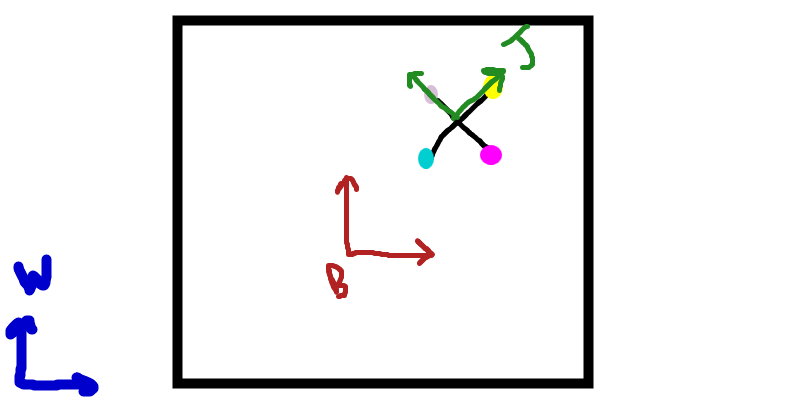

# Jack in a Box - Dynamics Simulation

This project involves simulating impacts between a "jack" and a box inside a cup. It serves as the final project for the 314 Machine Dynamics course.

---

## Frames and Transformations

### Frames
The simulation uses three primary frames of reference:
- **W** - World Frame
- **B** - Box Frame
- **J** - Jack Frame

### Transformations
Three key transformations relate these frames:
- \( g_{wb} \): World to Box
- \( g_{wj} \): World to Jack
- \( g_{bj} \): Box to Jack

These transformations are essential for calculating the positions, orientations, and velocities of the jack and the box relative to each other and the world.

---

## Dynamics

The motion of the system is governed by the Euler-Lagrange equations:

\[
\frac{d}{dt} \left( \frac{\partial L}{\partial \dot{q}_i} \right) - \frac{\partial L}{\partial q_i} = 0
\]

Where:
- \( L \) is the Lagrangian, defined as the difference between kinetic energy (\( KE \)) and potential energy (\( PE \)):

  \[
  L = KE - PE
  \]

- \( q_i \) represents the generalized coordinates:
  \[
  q_i = [x_{jack}, y_{jack}, \theta_{jack}, x_{box}, y_{box}, \theta_{box}]
  \]

By substituting \( q_i \) into the Euler-Lagrange equations, six equations of motion are derived—one for each degree of freedom. 

In this simulation:
- The right-hand side of the equations is set to zero, except for \( y_{box} \), where a constant external force of \( 44 \) is used. 
- This hardcoded value ensures the box remains on screen, allowing the impacts to be continuously visualized.

---

## Simulation

https://github.com/user-attachments/assets/d72e048a-e65d-4e09-801a-e429fc749cc6

The simulation showcases the dynamics of the system, with the jack interacting with the box. Here are some notable aspects:

1. **Impacts**: The jack repeatedly collides with the box, illustrating the effect of forces and energy transfer in a constrained environment.
2. **Constant Box Position**: The \( y_{box} \) value is fixed, keeping the box visible throughout the simulation. This design choice enhances viewer experience by preventing the box from moving out of frame.
3. **Jack's Speed**: The rapid motion of the jack stems from the relatively low masses assigned to its endpoints. The small masses reduce the inertia, leading to faster accelerations and more pronounced movements.
4. **Visualization of Dynamics**: The simulation effectively demonstrates how the system's energy is distributed and conserved during these perfectly elastic impacts, providing insights into real-world dynamic systems.

This project combines theoretical principles of machine dynamics with practical simulation to offer a compelling visualization of complex interactions.
